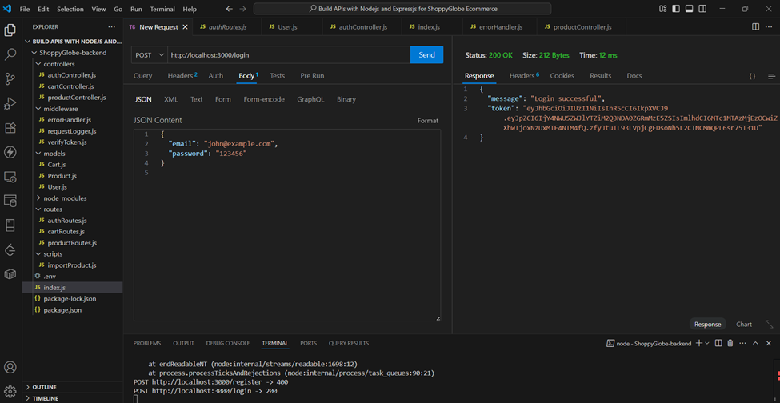
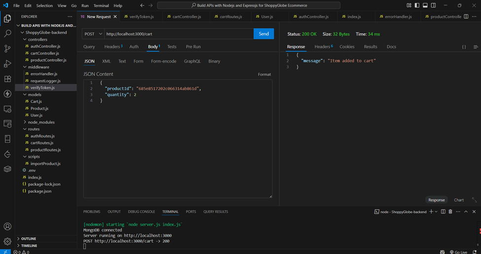

# **ShoppyGlobe Backend: CRUD Operations with Screenshots**

## Overview

This project is a RESTful backend API built with **Node.js**, **Express**, and **MongoDB** to support an e-commerce frontend called ShoppyGlobe. It handles products, user authentication, and cart operations using proper MVC architecture.

### Key Features

- Product listing and detail routes (`GET /products`, `GET /products/:id`)
- JWT-based user authentication (`POST /register`, `POST /login`)
- Cart management (`POST`, `PUT`, `DELETE /cart`)
- MongoDB integration using Mongoose
- Input validation and global error handling
- Import script to populate products from DummyJSON

## Folder Structure (MVC)
<<<<<<< HEAD

=======
```
>>>>>>> c0da69084f2fc251de9eba26abb52150e243d943
├── controllers/
│ ├── productController.js
│ ├── cartController.js
│ └── authController.js
├── models/
│ ├── Product.js
│ ├── Cart.js
│ └── User.js
├── routes/
│ ├── productRoutes.js
│ ├── cartRoutes.js
│ └── authRoutes.js
├── middleware/
│ ├── verifyToken.js
│ └── requestLogger.js
├── scripts/
│ └── importProduct.js
├── .env
├── server.js
<<<<<<< HEAD

=======
```
>>>>>>> c0da69084f2fc251de9eba26abb52150e243d943
---

## Setup Instructions

### 1. Clone and Install

```
<<<<<<< HEAD
git clone https://github.com/Rawat107/APIs-For-ShoppyGlobe.git
=======
git clone https://github.com/yourusername/shoppyglobe-backend.git
>>>>>>> c0da69084f2fc251de9eba26abb52150e243d943
cd shoppyglobe-backend
npm install
```

### 2. Configure Environment Variables

## Create a .env file in the root with:

```
PORT=3000
MONGO_URI=mongodb://localhost:27017/shoppyglobe
JWT_SECRET=ShoppyGlobe
```

### 3. Import Product and Start the server

```
npm run dev

```

## **1\. Import Products (via `node importPorduct.js` or `npm run dev`)**

**Description:**  
 Running the import script before the index.js to seed DummyJSON products into MongoDB.

npm run dev \# or node scripts/importProduct.js(seprately)

**Success Example:**

- Imported 30 new products.


Or:

- All products already imported.


**Error Example:**

MongoDB connection failed:  


---

## **2. GET - All Products**

**Route:** `GET /products`

**Success Response (200):**


**Error Response (Route not found):**


---

## **3. GET - Single Product by ID**

**Route:** `GET /products/:id`

**Success Response (200):**


**Error Response (404 - Not Found):**


**Error Response (500 - Invalid ID):**


---

## **4. User Authentication**

### **A. Register New User**

**Route:** `POST /register`

**Success Response (201):**


**MongoDB Compass showing added user:**


**Error Response (400 - Missing Fields):**


**Error Response (400 - User already exists):**


---

### **B. Login User**

**Route:** `POST /login`

**Success Response (200):**



**Error Response (400 - Missing Fields):**


**Error Response (401 - Invalid Credentials):**


---

## **5. POST to Cart (Add Item)**

**Route:** `POST /cart`  
**Headers:** Authorization: JWT <token>

**Success Response (200):**



**Mongo Compass Item has added to the database**  


**Error Response (401 - Unauthorized):**


**Error Response (400 - Validation Error):**


---

## **6. PUT to Cart (Update Quantity)**

**Route:** `PUT /cart/:id`  
**Headers:** Authorization: JWT <token>

**Success Response (200):**


**Mongo Compass Updated:**  


**Error Response (404 - Not Found):**


**Error Response (403 - Unauthorized):**


**Error Response (400 - Invalid ID):**


---

## **7. DELETE Cart Item**

**Route:** `DELETE /cart/:id`  
**Headers:** Authorization: JWT <token>

**Success Response (200):**


**Mongo Compass item is removed from the cart:**


**Error Response (404 - Not Found):**


**Error Response (403 - Unauthorized):**


**Error Response (400 - Invalid ID):**


